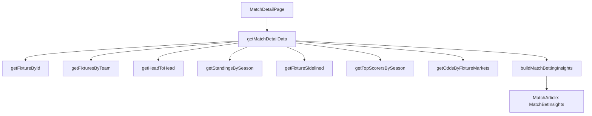

# Match betting insights plan

## Mevcut durum (kısa teşhis)

- Match detail sayfası veriyi server tarafında `getMatchDetailData()` ile topluyor: fixture detail + standings + H2H + 1X2 odds + her takımın son 5 maçı formu. Bu veri `src/app/matches/[slug]/page.tsx `üzerinden `MatchArticle`’a prop olarak gidiyor.
- `MatchArticle` içindeki `Match Prediction & Analysis` şu an basit bir skor/heuristic ile metin üretiyor; sakat/cezalı, kilit oyuncu formu, deplasman/ev kırılımı ve market bazlı bahis önerisi yok.
- API katmanı zaten cache profilleriyle (`short/medium/long`) Next fetch cache’i kullanıyor; ek analiz için doğru yol, **ek endpoint çağrılarını minimize edip**, kalanları **cache profili + concurrency limit** ile yönetmek.

## Hedef çıktı (UI)

- `Match Prediction & Analysis` bölümü İngilizce kalacak ve şu bölümleri gösterecek:
  - **Form summary**: overall + home/away split (last 5)
  - **H2H summary**: last N + away-team-as-away vs this opponent gibi venue kırılımları
  - **Injuries/suspensions impact**: sidelined list + “key player missing” vurgusu
  - **Key players**: sezon top scorers/assists/ratings ile destekli kısa etki
  - **Bet recommendations**: çoklu market için skorlanmış öneriler (en üstte 3-5 pick), ayrıca “avoid/low confidence” işaretleri

## Veri kaynakları (SportMonks)

- Zaten kullanılanlar:
  - Fixture detail: `GET /fixtures/{id}` (include: participants, scores, state, league, venue, events, statistics.type, lineups.player, formations, referees.referee, coaches)
  - H2H: `GET /fixtures/head-to-head/{homeId}/{awayId}`
  - Team recent fixtures: `GET /fixtures/between/{start}/{end}/{teamId}`
  - Standings: `GET /standings/seasons/{seasonId}`
  - Odds (mevcut): `GET /odds/pre-match/fixtures/{fixtureId}/markets/1`
- Eklenecekler (optimize şekilde):
  - **Sidelined**: `GET /fixtures/{id}?include=sidelined` (tek çağrıda sakat/cezalı listesi)
  - **Odds multi-market**: `GET /odds/pre-match/fixtures/{fixtureId}/markets/{marketId}` (sınırlı concurrency ile seçili market seti)
  - **Key player sinyali**: `GET /topscorers/seasons/{seasonId}` farklı `type`’lar ile (goals/assists/rating)
  - (Opsiyonel, veri varsa): `xGFixture`, `predictions`, `expectedLineups` include’ları — sadece mevcut fixture endpoint’inde mevcutsa ve kullanım netse.

## Mimari yaklaşım

### 1) Data Acquisition (minimum çağrı, maksimum reuse)

- `src/lib/queries.ts` içinde match detail için 2 seviye fonksiyon:
  - **Light**: metadata için sadece `getFixtureById()` (şu an metadata gereksiz ağır)
  - **Full**: sayfa için `getMatchDetailData()` + yeni analiz verileri
- Yeni analiz data’sı **server’da** hazırlanacak; client `MatchArticle` sadece render edecek.

### 2) Feature Extraction (hesapların optimize edilmesi)

- Takım form metrikleri (son 5):
  - PPG (points per game), GF/GA, gol yeme/atma serisi, clean sheet oranı, BTTS oranı
  - Home/away split: (takım ev mi deplasman mı oynadığına göre)
- H2H metrikleri:
  - overall H2H (last N)
  - venue-aware H2H: away team’in bu rakibe **deplasmanda** oynadığı subset
- Sidelined impact:
  - fixture’daki `sidelined` listesi
  - “key player” eşlemesi: sezon top scorers/assists/rating listesindeki playerId’ler ile çakıştırma
  - Pozisyon bazlı ağırlık (GK/DEF/MID/FWD) varsa daha iyi; yoksa conservative ağırlık
- Odds/Value:
  - odds → implied probability
  - model skorları → “relative confidence”
  - fark büyükse “value-ish” etiketi (kesin kazanç iddiası yok)

### 3) Recommendation Engine (market bazlı skorlayıcı)

- “All markets” isteğini **pratik ve sürdürülebilir** yapmak için:
  - Repo’da bir `MARKET_CATALOG` (ID → anlam) listesi tutacağız (başlangıçta en yaygın market seti)
  - Her market için: (1) prerequisites var mı? (2) skor üret (0-100) (3) açıklama üret
  - UI: her zaman **Top picks** (3-5) + “All evaluated markets (collapsed)”
- İlk iterasyonda garanti edilebilir market setleri:
  - 1X2, Double Chance, DNB
  - O/U 1.5 / 2.5 / 3.5
  - BTTS
  - (Kart/korner) yalnızca veri/odds düzgün geliyorsa, aksi halde “not available”

## Cache + performans stratejisi (smart-cache çizgisi)

- **API cache**: `sportmonks-client.ts` zaten cache profilleri + retry + metrics sağlıyor.
- **N+1 kaçınma**:
  - Oyuncu detayını (GET /players/{id}) tüm kadro için çekmek yok.
  - Key player sinyali: önce `topscorers` endpoint’leri.
  - Sidelined’daki player detayına ihtiyaç olursa: sadece “key” oyuncular için fallback.
- **Concurrency limit**:
  - Multi-market odds çağrıları 4-6 paralel ile sınırlandırılacak.
- **Compute memoization**:
  - Analiz fonksiyonu saf/yan etkisiz tutulacak; server tarafında `react/cache` ile request-level memoization.

## Değişecek / eklenecek dosyalar

- Veri ve types:
  - [`src/types/sportmonks/raw/*`](src/types/sportmonks/raw): fixture `sidelined` raw tipi ekleme
  - [`src/types/football.ts`](src/types/football.ts): `Sidelined` + `MatchInsights` + `BetRecommendation` tipleri
- API katmanı:
  - [`src/lib/api/football-api.ts`](src/lib/api/football-api.ts):
    - fixture include listesine `sidelined` ekleme
    - multi-market odds fetch helper’ları
    - gerekiyorsa “markets catalog” (ID listesi) için yardımcı
  - [`src/lib/api/sportmonks-mappers.ts`](src/lib/api/sportmonks-mappers.ts): sidelined mapper
- Query/data orchestration:
  - [`src/lib/queries.ts`](src/lib/queries.ts):
    - metadata için light fetch’e bölme
    - `getMatchDetailData()` içine `insights` ekleme
- UI:
  - [`src/components/match-detail/match-article.tsx`](src/components/match-detail/match-article.tsx):
    - Prediction bölümü yerine `MatchBetInsights` render
  - Yeni: `src/components/match-detail/match-bet-insights.tsx` (UI render)
  - Yeni: `src/lib/analysis/match-betting-insights.ts` (saf hesap + skor)

## Veri akışı (mermaid)

## Uygulama adımları (Fazlar)

- **Faz 0 — Scope & guardrails**: market katalog + concurrency limit + “confidence/avoid” standartları.
- **Faz 1 — Sidelined entegrasyonu**: fixture include + raw type + mapper + domain type.
- **Faz 2 — Form/H2H metrikleri**: mevcut homeForm/awayForm + h2h üzerinden venue-aware metrikler.
- **Faz 3 — Key player sinyali**: topscorers(goals/assists/rating) ile “missing impact”.
- **Faz 4 — Multi-market odds**: market bazlı odds fetch + minimal mapping + UI’daki market listesi.
- **Faz 5 — Recommendation engine**: market skorlayıcı + explanation generator.
- **Faz 6 — UI polish**: Top picks + collapsible “all markets” + boş veri durumları.

## Kabul kriterleri

- Match sayfasında `Match Prediction & Analysis` bölümünde:
  - Form + H2H + injuries + key players + odds destekli öneriler görünür.
  - API çağrıları “kontrollü” (concurrency limit) ve cache profilleri ile stabilize.
  - Metadata generation “analiz” çağrıları yapmaz (TTFB artmaz).
