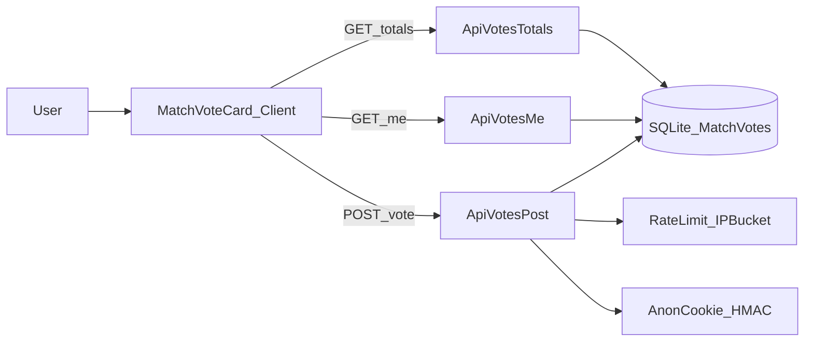

# Match sayfasına 1/X/2 kullanıcı oylaması (SQLite + rate-limit + optimize)

### Hedef

- `/matches/[slug] `sayfasının sağ kolonunda `OddsCard` ile `MatchInfoWidget` arasına **yeni bir kart** eklemek.
- Kart: **1 / X / 2** butonları + her seçeneğin altında **%** (toplam oylara göre) + kullanıcının seçimi vurgulu.
- Oylar `data/` altındaki **SQLite**’a yazılacak.
- **Spam koruması**: hCaptcha yok; **server-side rate limit + cookie tabanlı anonim kimlik + fixture başına 3 değişiklik** + kickoff sonrası kapama.
- **Optimizasyon**: yüzde hesaplamak için her seferinde ağır `GROUP BY` yerine **aggregate sayaç tablosu**.

### Mevcut yapıdan bulduklarımız (repo içi)

- Sidebar sırası şu şekilde: `OddsCard` -> `MatchInfoWidget` -> diğer widget’lar.
  - Kaynak: [`src/app/matches/[slug]/page.tsx`](/Users/anil/Documents/github/new-betsite/src/app/matches/[slug]/page.tsx)
- `OddsCard` sadece UI, tıklama/POST yok; yeni kart **client component** olmalı.
  - Kaynak: [`src/components/match-detail/odds-card.tsx`](/Users/anil/Documents/github/new-betsite/src/components/match-detail/odds-card.tsx)
- Projede SQLite için **better-sqlite3 singleton + schema init** pattern’i var (lineup DB ve sitemap-cache).
  - Kaynak: [`src/lib/lineup-db/connection.ts`](/Users/anil/Documents/github/new-betsite/src/lib/lineup-db/connection.ts)
- hCaptcha altyapısı var ama bu özellikte kullanmayacağız.
  - Kaynak: [`src/lib/captcha/verify-hcaptcha.ts`](/Users/anil/Documents/github/new-betsite/src/lib/captcha/verify-hcaptcha.ts)

### Önerilen veri modeli (SQLite)

Yeni bir DB dosyası: `data/match-votes.sqlite` (env ile override edilebilir).

- `match_vote_totals`
  - `fixture_id INTEGER PRIMARY KEY`
  - `home_count INTEGER NOT NULL`
  - `draw_count INTEGER NOT NULL`
  - `away_count INTEGER NOT NULL`
  - `total_count INTEGER NOT NULL`
  - `updated_at INTEGER NOT NULL`

- `match_votes`
  - `fixture_id INTEGER NOT NULL`
  - `voter_id TEXT NOT NULL` (cookie’den gelen anonim id)
  - `choice TEXT NOT NULL` ("home"|"draw"|"away")
  - `change_count INTEGER NOT NULL` (0’dan başlar, değişiklikte +1)
  - `created_at INTEGER NOT NULL`
  - `updated_at INTEGER NOT NULL`
  - `PRIMARY KEY (fixture_id, voter_id)`

- `vote_rate_limits` (IP tabanlı)
  - `ip TEXT NOT NULL`
  - `bucket TEXT NOT NULL` (örn: `minute:2025-12-12T10:05` / `day:2025-12-12`)
  - `count INTEGER NOT NULL`
  - `updated_at INTEGER NOT NULL`
  - `PRIMARY KEY (ip, bucket)`

### Güvenlik / anti-spam tasarımı (hCaptcha’sız)

- **Anonim kimlik**: HttpOnly cookie (`mv_id`) + HMAC imza (`mv_sig`).
  - İmza için yeni env: `VOTE_COOKIE_SECRET`.
  - Cookie yok/bozuksa server yeni id üretir ve set eder.
- **Rate limit (server-side, IP)**:
  - Örn. `max 30 istek / 5 dk` ve `max 200 / gün` (bucket mantığıyla).
  - Limit aşılırsa `429` (`RateLimitError`/`AppError`).
- **Fixture başına oy değiştirme**:
  - Kickoff sonrası **kapalı** (`403`).
  - Kullanıcı mevcut oyunu değiştirirse `change_count` artar; **toplam en fazla 3 değişiklik**.
  - İsteğe bağlı ek koruma: değişiklikler arası minimum 10 saniye cooldown.
- **LocalStorage sadece UX**:
  - Hızlı “seçili” görünümü ve gereksiz POST’ları azaltmak için.
  - Asıl enforcement **server** (cookie+db+rate limit).

### API yüzeyi (optimizasyon odaklı)

İki GET + bir POST ile cache/performans daha iyi olur:

- `GET /api/fixtures/[id]/votes` → sadece **aggregate** (cookie’ye bağlı değil) → kısa süreli cache uygulanabilir.
- `GET /api/fixtures/[id]/votes/me `→ sadece **kullanıcının mevcut tercihi** (cookie’ye bağlı) → `private, no-store`.
- `POST /api/fixtures/[id]/votes` → oy ver / değiştir → transaction içinde totals güncelle, güncel totals + userChoice döndür.

### UI entegrasyonu

- Yeni bileşen: `MatchVoteCard` (client)
  - Yerleşim: `OddsCard` ile `MatchInfoWidget` arasına.
  - Görünüm: `OddsCard` ile aynı grid (3 kolon), seçili buton vurgulu, altında yüzde.
  - Metin: “Kickoff sonrası kapanır”, “Toplamda 3 kez değiştirebilirsin”.
- Server page’de kullanım: [`src/app/matches/[slug]/page.tsx`](/Users/anil/Documents/github/new-betsite/src/app/matches/[slug]/page.tsx)
- Export: [`src/components/match-detail/index.ts`](/Users/anil/Documents/github/new-betsite/src/components/match-detail/index.ts)

### Transaction ve tutarlılık

- `POST` akışı tek `db.transaction()` içinde:

1. Mevcut user vote’u oku

2. Kural kontrolü (kickoff, change_count)

3. `match_votes` upsert

4. `match_vote_totals` delta update (insert’te +, change’te -/+)

### Mermaid akış diyagramı

### Notlar / varsayımlar

- Bu yaklaşım **self-host/VPS** gibi tek disk paylaşan Node runtime’da ideal. Eğer serverless ortam düşünülüyorsa, SQLite dosyası instance’lar arası paylaşılamayacağı için farklı storage gerekir.
